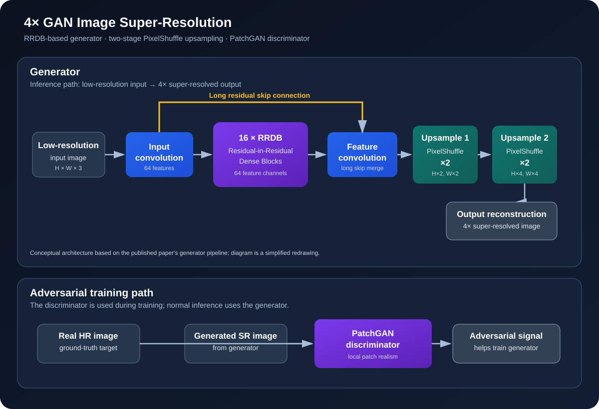

# 4× GAN Image Upscaler

### Deep Learning · Computer Vision · Image Super-Resolution

**Turn low-resolution images into 4× larger images with a trained RRDB-based GAN.**

[](https://www.python.org/)
[](https://pytorch.org/)
[](https://fastapi.tiangolo.com/)
[](#how-it-works)
[](https://huggingface.co/coolknifer333444/image-upscaler-gan)

[**Get the Model Weights**](https://huggingface.co/coolknifer333444/image-upscaler-gan) · [**Research Paper**](https://zenodo.org/records/19594561) · [**API Docs**](#api-reference) · [**Installation**](#getting-started)

---

## ✨ Highlights

- 🖼️ **4× super-resolution** — increases both image width and height by four.
- 🧠 **RRDB-based generator** — an ESRGAN-inspired architecture trained for image reconstruction.
- 🧪 **Multi-component loss** — combines reconstruction, perceptual, edge-aware, SSIM-based, and adversarial objectives.
- 🌐 **Interactive web interface** — select images, run upscaling, and compare results with a before/after slider.
- ⚡ **FastAPI backend** — inference endpoints and interactive API documentation.
- 📊 **Benchmark evaluation** — the associated paper reports PSNR, SSIM, and LPIPS results across six datasets.
- 📦 **One-click Windows launch** — installs dependencies and downloads the checkpoint automatically.

## 📖 Overview

This project explores **single-image super-resolution (SISR)**: reconstructing a higher-resolution image from a lower-resolution input. It combines a trained PyTorch GAN with a FastAPI service and a browser-based interface.

The generator uses Residual-in-Residual Dense Blocks (RRDBs), dense feature connections, and two PixelShuffle upsampling stages to produce a 4× output.

> **Architecture note:** This is an ESRGAN-inspired implementation, not an exact reproduction of the original ESRGAN architecture.

## 📄 Research Publication

The associated paper, **“GAN-based Super-Resolution for Image Enhancement using Multiple Loss Function,”** describes a GAN-based 4× super-resolution framework using an RRDB-based generator, a PatchGAN discriminator, and a hybrid loss function.

- **Journal:** International Journal of Engineering Research & Technology (IJERT)
- **Publication:** Volume 15, Issue 04, April 2026
- **Paper ID:** IJERTV15IS040757
- **Authors as listed in the publication:** Ishan Lodwal, Sherry Verma, Dev Singh Ahluwalia, and Ananya Khurana
- **Research record:** [Zenodo record 19594561](https://zenodo.org/records/19594561)
- **Model checkpoint:** [Hugging Face model repository](https://huggingface.co/coolknifer333444/image-upscaler-gan)

The paper's author list is reproduced as published. This repository highlights the runnable implementation and model artifact; it does not assign individual contributions to the paper's coauthors.

### Reported benchmark results

The following values are reproduced from the paper's quantitative results table. They are the **published paper's reported results**, not a claim that every repository revision or downloaded checkpoint has been independently re-evaluated.

| Dataset | PSNR (dB) | SSIM | LPIPS |
|---|---:|---:|---:|
| Set5 | 29.07 | 0.8547 | 0.1058 |
| Set14 | 26.35 | 0.8422 | 0.1854 |
| BSD100 | 25.54 | 0.6774 | 0.2477 |
| Urban100 | 23.72 | 0.9452 | 0.1797 |
| Manga109 | 27.37 | 0.9681 | 0.0789 |
| General100 | 28.65 | 0.8631 | 0.1235 |

The paper also compares PSNR and LPIPS with ESRGAN and MOBOSR. Those comparisons show trade-offs across datasets rather than universal superiority over both baselines; see the paper for the full comparison tables and methodology.

## 🧠 How It Works

### Generator and training architecture

The diagram below is a clean redrawing of the model pipeline described in the paper. It separates the generator used for 4× inference from the PatchGAN discriminator used during adversarial training.



### Generator overview

1. **Input convolution** extracts features from the low-resolution image.
2. **16 RRDB blocks** process features using dense connections and residual learning.
3. **Feature convolution and long skip connection** combine the deeper features with earlier generator features.
4. **Two PixelShuffle stages** each upscale spatial dimensions by 2×, producing 4× output dimensions overall.
5. **Output reconstruction** produces the super-resolved image.

The paper reports training for **600 epochs**.

### Training components

- Charbonnier reconstruction loss
- VGG perceptual loss
- Edge-aware loss
- SSIM-based loss
- Adversarial loss with a PatchGAN discriminator

Synthetic degradation includes bicubic downsampling, blur, noise, and JPEG compression.

## 🧰 Tech Stack

| Area | Technologies |
|---|---|
| Deep learning | Python, PyTorch, Torchvision |
| Model architecture | RRDB-based generator, PatchGAN discriminator, PixelShuffle |
| Backend | FastAPI, Uvicorn |
| Image processing | Pillow |
| Frontend | HTML, CSS, JavaScript |
| Model hosting | Hugging Face |
| Research archive | Zenodo |

## 🚀 Getting Started

### Requirements

- Windows for the one-click `start.bat` workflow
- Python or Conda
- Internet access for initial dependency and model downloads
- Approximately 184 MB for the checkpoint, plus space for dependencies and images

### Option A — Windows Quick Start

**Recommended if you just want to run the app.**

1. Clone the repository:

   ```bash
   git clone https://github.com/Ishan333444/Image_Upscaler
   cd Image_Upscaler
   ```

2. Run `start.bat` from the project folder.

3. On first launch, the script creates a project-local `.venv`, installs `requirements.txt`, downloads the checkpoint if missing, starts the API, and opens the web interface.

4. Open [http://127.0.0.1:8000/app](http://127.0.0.1:8000/app).

Later launches reuse the existing environment and checkpoint. The launcher uses its own `.venv`, even if a Conda environment is active.

### Option B — Conda

**1. Clone the repository**

```bash
git clone https://github.com/coolknifer333444/image-upscaler-using-GAN.git
cd image-upscaler-using-GAN
```

**2. Create and activate the environment**

```bash
conda env create -f environment.yml
conda activate imageupscaler
```

**3. Download the model checkpoint**

Run this in PowerShell from the project root:

```powershell
Invoke-WebRequest `
  -Uri "https://huggingface.co/coolknifer333444/image-upscaler-gan/resolve/main/checkpoint_gan_epoch_600.pth" `
  -OutFile "checkpoint_gan_epoch_600.pth"
```

The checkpoint must be in the project root beside `app.py`.

**4. Start the server**

```bash
python -m uvicorn app:app --host 127.0.0.1 --port 8000
```

Open [http://127.0.0.1:8000/app](http://127.0.0.1:8000/app).

### Option C — Standard Python virtual environment

Create and activate a virtual environment on Windows:

```powershell
python -m venv .venv
.\.venv\Scripts\Activate.ps1
```

Install dependencies:

```bash
python -m pip install -r requirements.txt
```

Download the checkpoint using the PowerShell command in **Option B**, then start the server:

```bash
python -m uvicorn app:app --host 127.0.0.1 --port 8000
```

> **Checkpoint location:** `checkpoint_gan_epoch_600.pth` belongs in the project root beside `app.py`. It is hosted separately and is not stored in Git.

## 🕹️ Using the App

1. Launch the application using one of the methods above.
2. Open the web interface.
3. Add or select images in the interface. The project uses `input_images/` for input files.
4. Run the 4× upscaling process.
5. View generated results in the interface. Outputs are saved in `upscaled_images/`.

For example, a 256 × 256 input produces a 1024 × 1024 output.

Inference speed depends on hardware and image dimensions. CPU inference is supported but may take several seconds per image.

## 🔌 API Reference

| Method | Endpoint | Purpose |
|:---:|---|---|
| `GET` | `/` | API status and model information |
| `GET` | `/images` | List available input images |
| `POST` | `/upscale/{filename}` | Upscale a selected image |
| `GET` | `/upscaled` | List generated output images |
| `GET` | `/app` | Serve the web interface |
| `GET` | `/docs` | Interactive API documentation |

The server listens on `127.0.0.1:8000` with the launch instructions above.

## 📈 Evaluation

The associated paper reports evaluation using:

- **PSNR** — pixel-level reconstruction fidelity
- **SSIM** — structural similarity
- **LPIPS** — perceptual similarity using deep features

Datasets reported in the paper include Set5, Set14, BSD100, Urban100, General100, and Manga109. Refer to the publication for benchmark comparisons, dataset-specific results, and the evaluation details.

## 📁 Project Structure

```text
image-upscaler-using-GAN/
├── assets/
│   └── model-architecture.svg
├── static/
│   └── index.html
├── input_images/
├── upscaled_images/
├── app.py
├── model.py
├── requirements.txt
├── environment.yml
├── start.bat
├── .gitignore
└── README.md
```

The trained checkpoint is downloaded separately from Hugging Face.

## ⚠️ Limitations

- GAN-generated details can look plausible without perfectly matching the original scene.
- Results vary with image content and input quality.
- Large images require more processing time and memory.
- CPU inference works but can be slower than GPU inference.
- The published results do not establish that this model outperforms every baseline on every metric.
- The architecture diagram is a simplified explanatory redrawing, not a layer-by-layer computational graph.

## 🛣️ Future Work

- Add reproducible benchmark scripts and baseline comparisons.
- Include screenshots of the live application and real before/after comparisons.
- Improve inference speed and GPU support.
- Expand image-format handling and batch-processing options.

## 👤 Project

**Ishan Lodwal**  
GitHub: [@Ishan333444](https://github.com/Ishan333444)

**Research publication authors:** Ishan Lodwal, Sherry Verma, Dev Singh Ahluwalia, and Ananya Khurana, as listed in the published paper.

---

*Built as a deep learning and computer vision project.*
